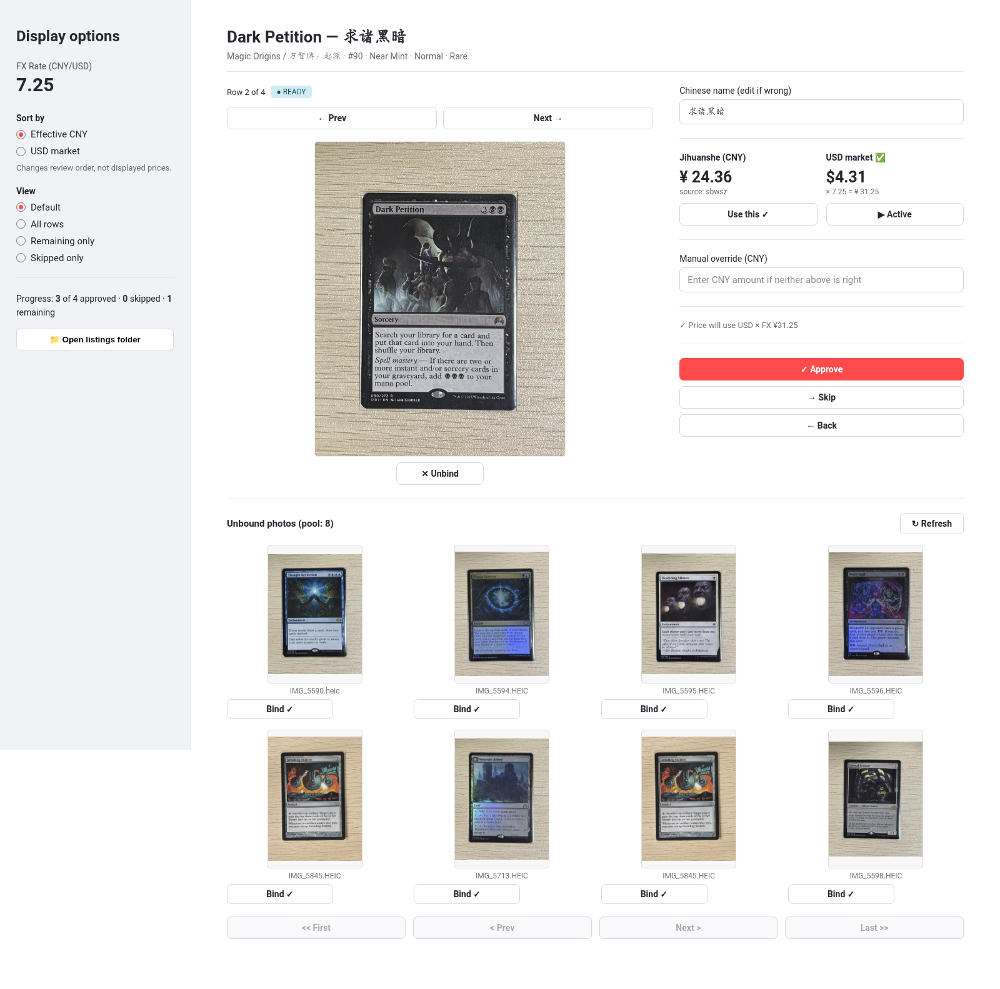
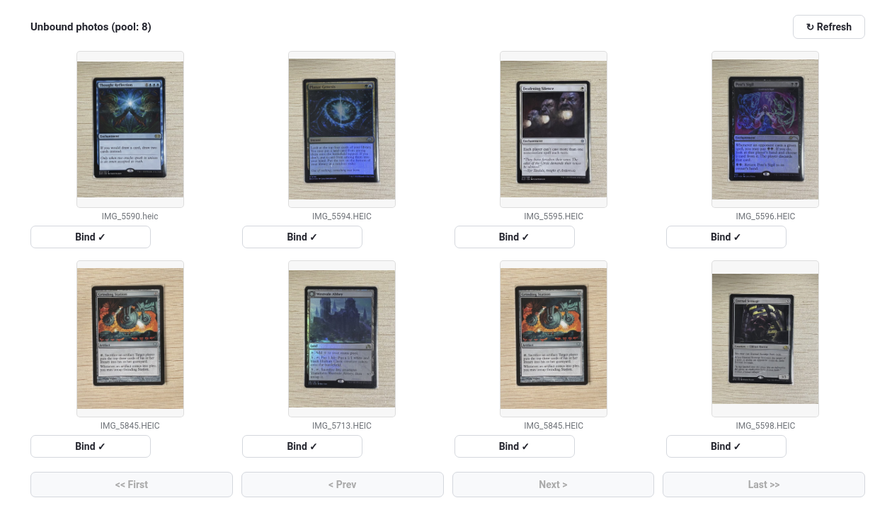
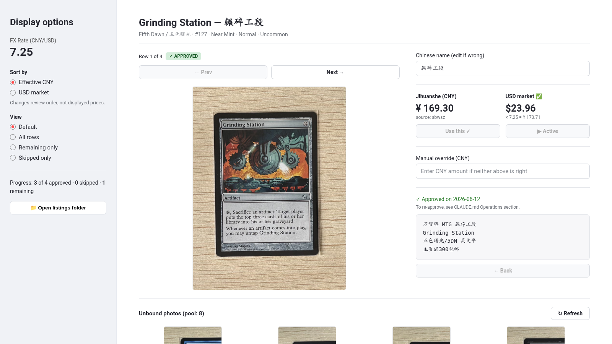

# MTG → Xianyu Listing Tool

A Python workflow that turns a **Magic: The Gathering collection export into ready-to-publish Xianyu (闲鱼 / Goofish) listings**.

The tool parses TCGPlayer collection data, enriches each card with Chinese MTG metadata and market pricing, lets the user review cards and bind real photos through a Streamlit interface, and generates the image, metadata, and Chinese description needed for each Xianyu listing.

Built to reduce the repetitive data-entry work involved in selling a large physical MTG collection while keeping pricing, condition verification, and final publishing under human control.

## Interface

### Review, pricing, and approval



The review interface combines the physical card photo, bilingual metadata, Jihuanshe pricing, TCGPlayer pricing, and final approval into a single workflow.

### Photo binding



Physical card photos are manually bound to collection records so the seller can verify that the exact physical card shown to buyers is the one being listed.

### Approved listing



After approval, the application generates the final JPEG, structured metadata, and Chinese Xianyu listing description.

## Motivation

Selling hundreds of individual MTG cards on Xianyu involves repeating the same process for every card:

1. Identify the exact card, set, printing, and treatment.
2. Find its Chinese card and set names.
3. Research current market prices.
4. Match the physical card with its photo.
5. Write a standardized Chinese listing description.
6. Upload the image, enter the price, and publish.

Doing this manually for a large collection requires substantial repetitive work. This project automates the data-processing portion of that workflow while deliberately leaving decisions that benefit from human judgment — such as photo verification, final pricing, and publishing — to the seller.

## Real-World Use

The pipeline was developed and used on an **808-card personal MTG collection**.

- 808 physical cards processed from a TCGPlayer collection export
- 803 / 808 cards automatically enriched with Chinese metadata
- Missing metadata is surfaced for manual review rather than fabricated
- Top 300 cards prepared and published through the workflow
- Handles English card names, Chinese translations, set information, foil status, special treatments, pricing, and physical card photos

The primary benefit is reducing the amount of manual research, transcription, file organization, and description writing required for each listing.

## Workflow

```text
TCGPlayer export
      ↓
   mtg-parse
      ↓
  rows.json
      ↓
  mtg-enrich  ←  sbwsz / 大学院废墟
      ↓
enriched.json
      ↓
Streamlit review UI  ←  iPhone HEIC photos
      ↓
review + photo binding + price selection
      ↓
approved listing
      ├── JSON metadata
      ├── JPEG photo
      └── Chinese description
      ↓
manual Xianyu publishing
```

## Pipeline

### 1. Scan and export

Cards are scanned using the TCGPlayer mobile app and exported as either:

- `.csv`
- Apple Numbers `.numbers`

The export provides the authoritative card identity, quantity, condition, finish, and TCGPlayer USD market price.

### 2. Parse

```bash
uv run mtg-parse data/collection.csv
```

The parser:

- normalizes the TCGPlayer export
- validates required fields
- preserves card variants and treatments
- separates foil and non-foil copies
- expands quantity greater than 1 into individual physical-card records

Output:

```text
data/rows.json
```

### 3. Enrich

```bash
uv run mtg-enrich data/rows.json
```

Each card is enriched using **sbwsz / 大学院废墟**, a Chinese MTG database.

The enrichment stage retrieves:

- Chinese card name
- Chinese set name
- set code
- reference card image
- Jihuanshe (集换社) CNY market price

Results are cached locally so repeated runs do not unnecessarily query the external service.

Output:

```text
data/enriched.json
```

### 4. Review

Start the local review interface:

```bash
uv run streamlit run src/mtg_xianyu/ui.py
```

For each physical card, the user can:

- browse and sort cards by price
- compare card metadata against the physical card
- bind the matching photo
- compare Jihuanshe CNY and TCGPlayer USD-derived price suggestions
- choose the final listing price
- correct a missing Chinese name if necessary
- verify condition and printing
- approve the listing

Photo matching is intentionally manual. For a collection of this size, visually confirming the physical card is more reliable than introducing an automated matcher that would still require manual verification.

### 5. Generate listing artifacts

Approving a card generates three files under `data/listings/`:

```text
{row_id}.json
{row_id}.txt
{set_code}-{collector_number} - {card_name} - {finish}.jpg
```

Example:

```text
SNC-250 - Jetmir's Garden - 英文闪.jpg
```

The human-readable filename makes it easy to locate the correct image from Xianyu's upload dialog.

The `.txt` file contains a compact four-line description:

```text
万智牌 MTG <Chinese card name>
<English card name>
<Chinese set name>/<set code> <finish>
主页满300包邮
```

Card treatments such as Borderless, Extended Art, Retro Frame, Showcase, Foil Etched, Rainbow Foil, and Surge Foil are classified automatically when generating Chinese finish labels.

### 6. Publish

Final publishing is performed manually in Xianyu:

1. Copy the generated description.
2. Upload the generated JPEG.
3. Select the appropriate condition.
4. Enter the reviewed CNY price.
5. Publish.

Automated account interaction is intentionally outside the current version.

## Key Features

### Chinese MTG metadata

The pipeline uses sbwsz as its Chinese MTG data source, including community translations for newer cards that do not have official Simplified Chinese paper printings.

If a Chinese name cannot be found, the pipeline leaves it unresolved and asks the user to review it instead of generating an unverified translation.

### Dual-market price review

The UI exposes two pricing signals when available:

- **Jihuanshe market price** in CNY
- **TCGPlayer market price** converted from USD

Instead of automatically choosing a price, both are shown to the seller so the final decision remains explicit.

### Treatment-aware listings

TCGPlayer card names frequently contain printing information such as:

```text
Imperial Seal (Borderless)
Sol Ring (Retro Frame)
Card Name (Foil Etched)
```

The description generator interprets these suffixes and converts them into appropriate Chinese listing labels.

### Physical-photo workflow

The application directly supports iPhone `.HEIC` photos.

During approval, the selected HEIC image is converted to JPEG and stored using a descriptive filename suitable for manual uploading to Xianyu.

### Defensive data processing

The pipeline includes validation and persistence safeguards designed for long-running manual review sessions:

- fail-fast input validation
- stable IDs for physical card copies
- expiring API caches
- negative caching for missing records
- atomic JSON and text writes
- collision-safe listing filenames
- persistent Streamlit review state

## Tech Stack

| Component | Technology |
| --- | --- |
| Language | Python 3.11+ |
| Package management | uv |
| UI | Streamlit |
| HTTP client | httpx |
| Apple Numbers parsing | numbers-parser |
| Image processing | Pillow |
| HEIC support | pillow-heif |
| String matching | RapidFuzz |
| Testing | pytest |

The project also contains `anthropic` and `imagehash` as foundations for possible future vision-based functionality, but neither is required by the current listing workflow.

## Installation

### Requirements

- Python 3.11+
- [uv](https://docs.astral.sh/uv/)

Clone the repository:

```bash
git clone https://github.com/Azraelpha/mtg-xianyu.git
cd mtg-xianyu
```

Install dependencies:

```bash
uv sync
```

Create the local data directories if necessary:

```bash
mkdir -p data/mtg_photos
mkdir -p data/listings
```

Collection exports, card photos, API caches, generated listings, and review state are intentionally excluded from Git.

## Quick Start

Place a TCGPlayer export under `data/`:

```text
data/collection.csv
```

Place physical card photos under:

```text
data/mtg_photos/
```

Run:

```bash
# 1. Parse TCGPlayer export
uv run mtg-parse data/collection.csv

# 2. Enrich card data
uv run mtg-enrich data/rows.json

# 3. Start review UI
uv run streamlit run src/mtg_xianyu/ui.py
```

Approved listings will appear under:

```text
data/listings/
```

## Additional Commands

Regenerate descriptions after a description-template change:

```bash
uv run mtg-describe
```

Preview listing migrations:

```bash
uv run mtg-reconcile
```

Apply listing migrations:

```bash
uv run mtg-reconcile --apply
```

`mtg-reconcile` updates descriptions and JPEG filenames together so existing approved listings remain internally consistent.

## Project Structure

```text
.
├── README.md
├── pyproject.toml
├── SPEC.md
├── CLAUDE.md
├── docs/
│   └── images/
│       ├── review-and-pricing.png
│       ├── photo-binding.png
│       └── approved-listing.png
├── src/
│   └── mtg_xianyu/
│       ├── parse.py
│       ├── enrich.py
│       ├── describe.py
│       ├── artifacts.py
│       ├── reconcile.py
│       ├── storage.py
│       └── ui.py
├── scripts/
└── tests/
```

### Core modules

**`parse.py`**  
TCGPlayer export → normalized physical-card records.

**`enrich.py`**  
Adds Chinese metadata, set information, images, and Jihuanshe pricing.

**`ui.py`**  
Streamlit interface for photo binding, price selection, metadata review, and approval.

**`describe.py`**  
Generates treatment-aware Chinese Xianyu descriptions.

**`artifacts.py`**  
Handles safe, human-readable listing artifact names and paths.

**`storage.py`**  
Provides atomic persistence for pipeline and UI data.

**`reconcile.py`**  
Safely migrates already-approved listing artifacts when description or naming rules change.

For the complete design and implementation rules, see [`SPEC.md`](SPEC.md).

## Testing

Run the test suite with:

```bash
uv run pytest
```

Tests cover the parser, enrichment logic, persistent storage, listing artifacts, reconciliation, description generation, and Streamlit workflow behavior.

## Design Decisions

### Why manually match photos?

The system operates on physical collectible cards where the exact copy and visible condition matter.

An incorrect automatic match can result in publishing the wrong physical card. Because an automatically generated match would still need to be visually inspected, manual photo binding was chosen for the current workflow.

### Why not automatically choose the price?

TCGPlayer and Jihuanshe represent different markets, currencies, and liquidity conditions.

The software performs the repetitive work of collecting and presenting pricing information but leaves the final selling-price decision to the user.

### Why not automatically publish to Xianyu?

The current project focuses on reliable listing preparation rather than automating marketplace account actions.

Manual publishing avoids browser-session and account-risk complexity while still removing most of the repetitive work before publication.

## Data Source Notes

Chinese MTG metadata is provided by the community-maintained **sbwsz / 大学院废墟** service.

The application:

- queries individual cards rather than crawling the database
- uses a descriptive User-Agent
- rate-limits requests
- caches responses locally
- handles server rate-limit responses
- treats the service as a soft dependency

This project is intended for personal collection management and listing automation rather than bulk extraction of external databases.

## Current Status

The complete v1 workflow is operational:

```text
TCGPlayer export
      ↓
Parsing
      ↓
Chinese metadata + price enrichment
      ↓
Human review + physical photo binding
      ↓
Price selection
      ↓
Listing artifact generation
      ↓
Manual Xianyu publishing
```

The system has been exercised end-to-end on a real 808-card collection.

## Possible Future Work

- optional vision-assisted photo matching
- configurable USD/CNY conversion and pricing strategies
- improved batch operations in the review interface
- additional listing analytics
- carefully evaluated browser-assisted Xianyu publishing

The goal is not full autonomy for its own sake. Automation is added where it removes repetitive work without removing useful human judgment.
